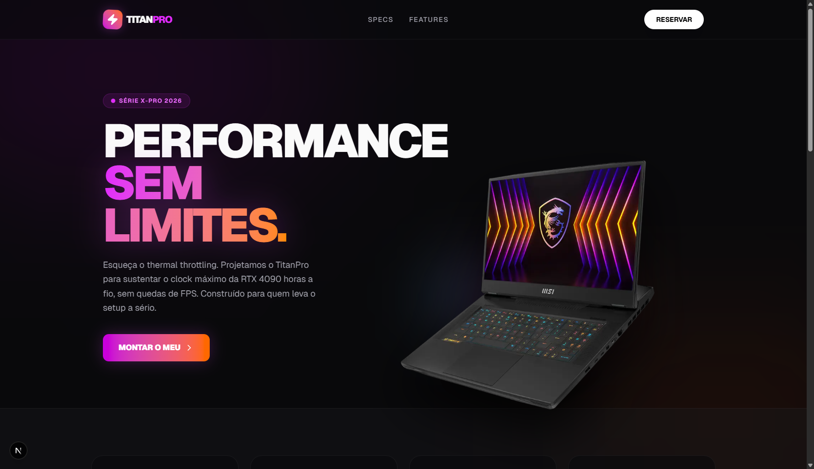
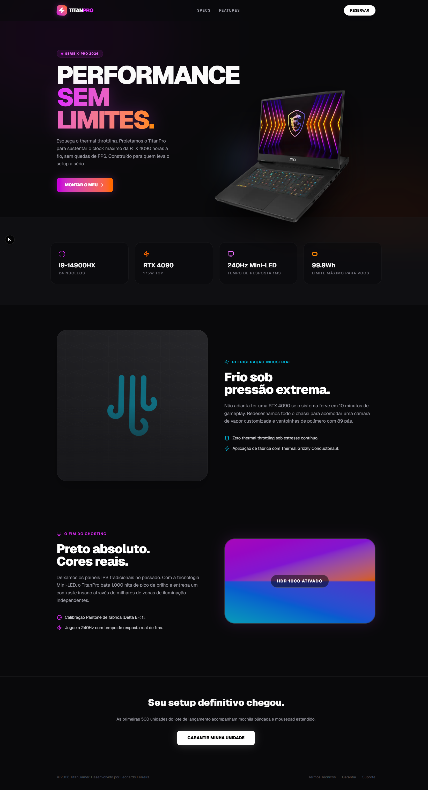
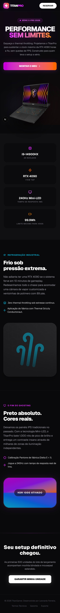

# ⚡ TitanGamer X-Pro | Premium Landing Page

<p align="center">
  
</p>

> Uma Landing Page imersiva e de alta performance desenvolvida para o lançamento de um Notebook Gamer premium. Foco total em experiência do usuário (UX), animações fluidas e conversão de vendas.

---

## 💻 Sobre o Projeto

O **TitanGamer X-Pro** é um projeto de simulação de E-commerce/SaaS focado em hardware de alto nível. O objetivo deste desenvolvimento foi criar uma interface que transmita a mesma sensação de "poder e tecnologia" que o produto físico oferece, utilizando o que há de mais moderno no ecossistema web.

---

## 📱 Responsividade: Web & Mobile

O design foi pensado no modelo *Mobile First*, garantindo que a experiência seja impecável tanto em telas ultrawide quanto em smartphones.

<p align="center">
  
  &nbsp;
  
</p>

---

## ✨ Funcionalidades e Interações

Mesmo sendo uma Landing Page demonstrativa, a interface é rica em micro-interações que retêm a atenção do usuário:

* **🚀 Efeito Parallax 3D:** A imagem principal do notebook reage ao scroll da página, criando uma ilusão de profundidade e flutuação entre as seções (desenvolvido com Framer Motion).
* **💎 Glassmorphism e Neon UI:** Navegação e cards de especificações utilizam desfoque de fundo (backdrop-blur) sobre gradientes vibrantes (Fuchsia e Laranja), simulando a iluminação RGB de setups gamers.
* **🖱️ Micro-interações de Hover:** Botões de "Comprar" e cards de "Features" possuem animações magnéticas e brilhos dinâmicos ao passar o mouse, incentivando o clique (Call to Action).
* **📱 Menu Adaptativo:** A barra de navegação detecta o scroll e ajusta sua transparência, garantindo legibilidade em qualquer ponto do site.

---

## 🛠️ Tecnologias Utilizadas

A stack foi escolhida para garantir 60fps nas animações e SEO técnico impecável:

* **Next.js 14** (App Router)
* **React.js**
* **Tailwind CSS v4** (Estilização utilitária avançada)
* **Framer Motion** (Engine de física e animação 3D/Scroll)
* **Lucide React** (Iconografia)

---

## ⚙️ Como executar o projeto localmente

Para testar a fluidez das animações na sua própria máquina, siga os passos:

```bash
# 1. Clone o repositório
git clone [https://github.com/devLeo3301/titangamer-lp.git](https://github.com/devLeo3301/titangamer-lp.git)

# 2. Acesse o diretório
cd titangamer-lp

# 3. Instale as dependências
npm install

# 4. Inicie o servidor de desenvolvimento
npm run dev